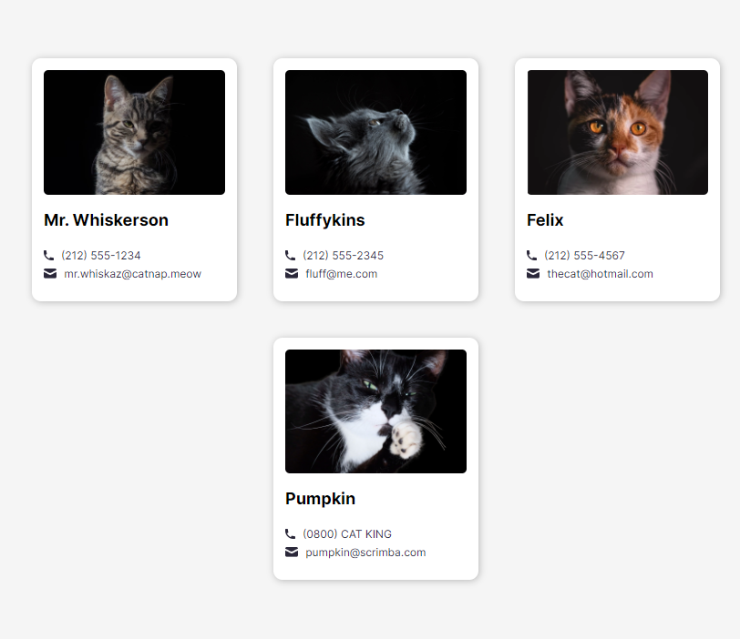
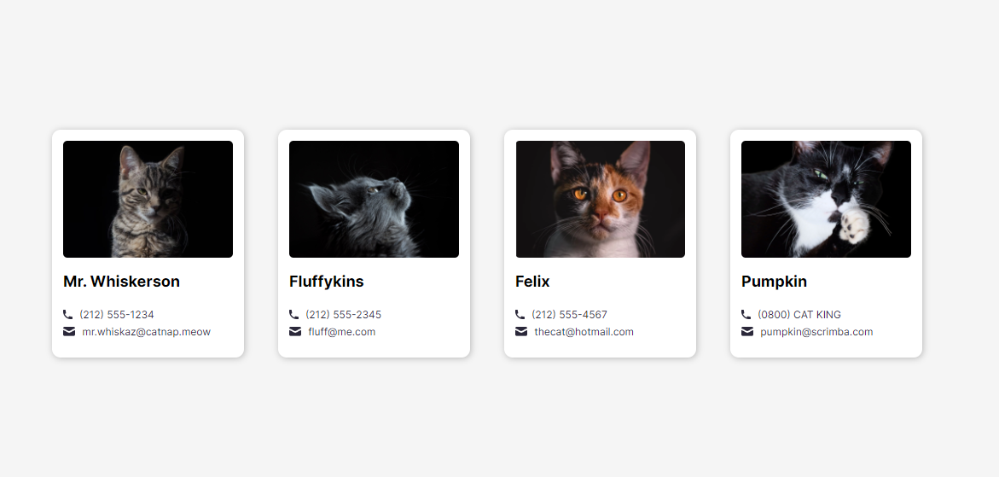

# My Cats Email Addresses

https://my-cats-emails.netlify.app/

This is my simple site which I made with React & Vite. This shows the Cats' images with email and phone numbers :)

### Mobile Version


### Tablet Version



### Desktop Version




-----

## Development 🛠🔨

Quick start:

```
# pnpm create vite

$ yarn
# npm install
# pnpm install

$ yarn build
# npm run build
# pnpm run build

$ yarn dev
# npm run dev
# pnpm run dev
```


Run Webpack in watch mode to continually compile the JavaScript as you work:

```
$ yarn watch 
# npm run watch 
# pnpm run watch
```

Head over to https://vitejs.dev/ to learn more about using vite


## Cloning the project 🔩 📪

```
# Clone this repository
$ gh repo clone MastooraTurkmen/My-Cats

# Go inside the repository
$ cd my-cats

```

-----

## Languages and Tools are used

1. **Languages**
    + [HTML](https://github.com/topics/html)
    + [CSS](https://github.com/topics/css)
    + [React](https://github.com/topics/react)
    + [JavaScript](https://github.com/topics/javascript)

2. **Tools** 
    + [Chrome](https://github.com/topics/chrome)
    + [VSCode](https://github.com/topics/vscode)
    + [Figma](https://github.com/topics/figma)

-----


## Deployment📥

1. How to deploy our project to the Netlify site?
2. I use [Netlify App](https://app.netlify.com/) for deploying my projects.
3. Go to the Netlify site and select Add a new site.
4. From there select **_Deploy with Github_**.
5. Then write your project name and select it.
6. After selecting here you can see that the project **_Review configuration for My-Cats_** and then select the **_Deploy My-Cats_** Button.
7. Now your project is Live.

------

# React + Vite

This template provides a minimal setup to get React working in Vite with HMR and some ESLint rules.

Currently, two official plugins are available:

- [@vitejs/plugin-react](https://github.com/vitejs/vite-plugin-react/blob/main/packages/plugin-react/README.md) uses [Babel](https://babeljs.io/) for Fast Refresh
- [@vitejs/plugin-react-swc](https://github.com/vitejs/vite-plugin-react-swc) uses [SWC](https://swc.rs/) for Fast Refresh

-----

## Author 👩🏻‍💻 

**Mastoora Turkmen**  
[LinkedIn](https://www.linkedin.com/in/mastoora-turkmen/) 
