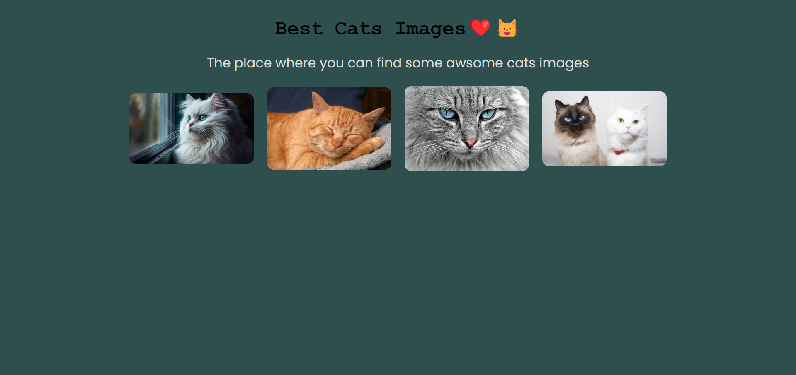
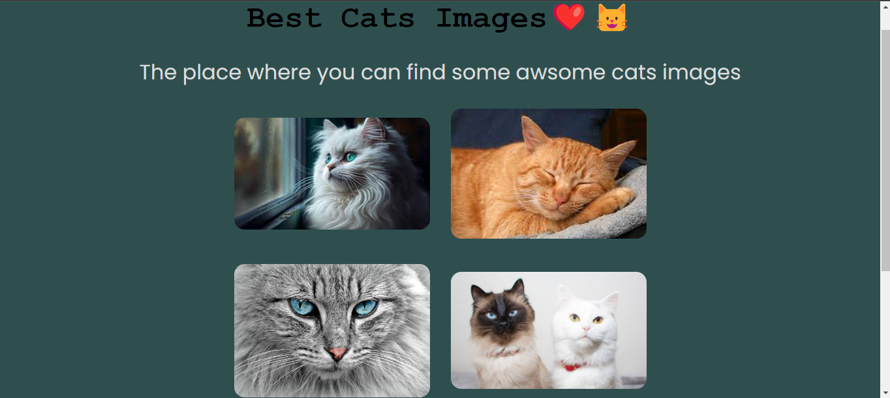
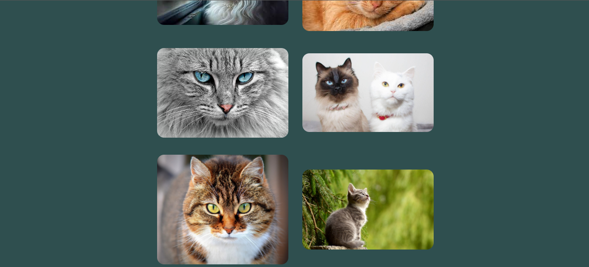
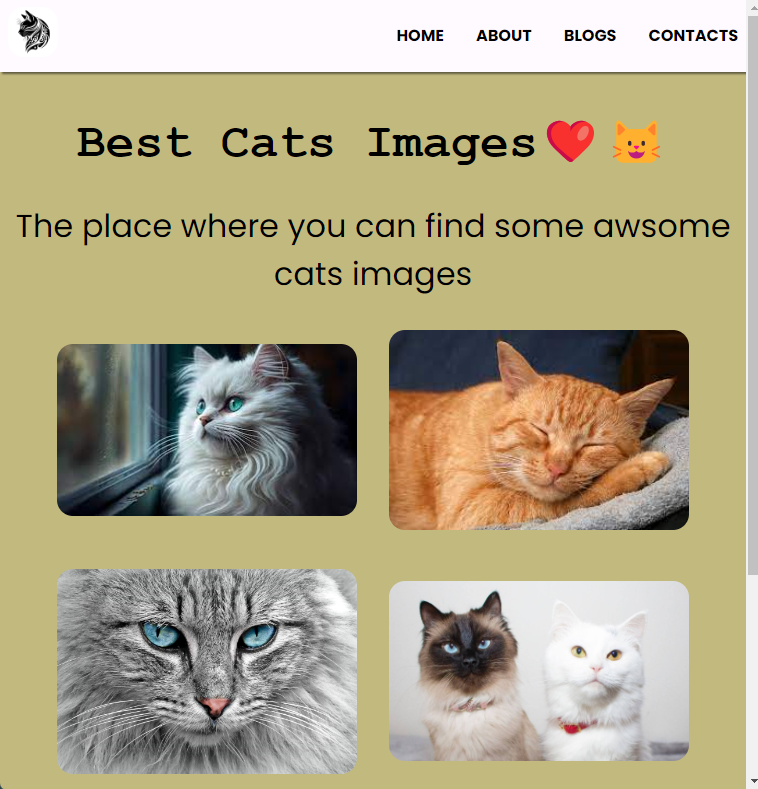

# 100DaysOFTheCode

## First Day of Code

> My first Cats Prject for _*100DaysOFTheCode*_

## Second Day of Code

1. Adding _a_ link to images
2. Adding other images to the site
3. Display **grid**
4. changing display _flex_ to display _grid_

## Third Day of Code

- Adding Navbar
- Adding _ul_ and _li_ to the nav
- Adding Link to the **Home**, **About**, **Blogs**, and **Contact**.
- Adding _Cat Logo_ on Site
- Changing the _background color_ and adding **Box Shadow** on navbar
- Adding more cats images
- Adding **hover**

