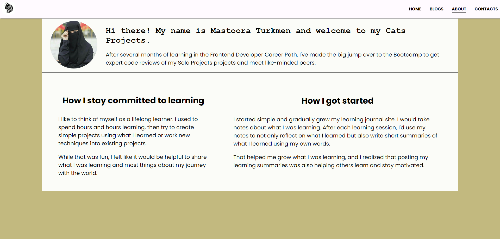

# 100DaysOFTheCode

## First Day of Code

> My first Cats Prject for _*100DaysOFTheCode*_ > https://my-best-cats-project.netlify.app/

## Fifth Day of Code

- Adding **About** Page Index
  - Adding about my learning progress
  - How I stay committed to learning
  - How I got started

## Sixth Day of Code

- Adding **Contacts** Page Index

  - Adding forms

    - Label
    - Input
    - textarea
    - Submit Button

  - Adding Logo to my site
  - Styling the form
    - flex box
    - padding
    - hover
    - focus
    - shadow

## Seventh Day of Code

- Adding Aritcle about _**Persain Cats**_
- some persain cats images
- links
-

