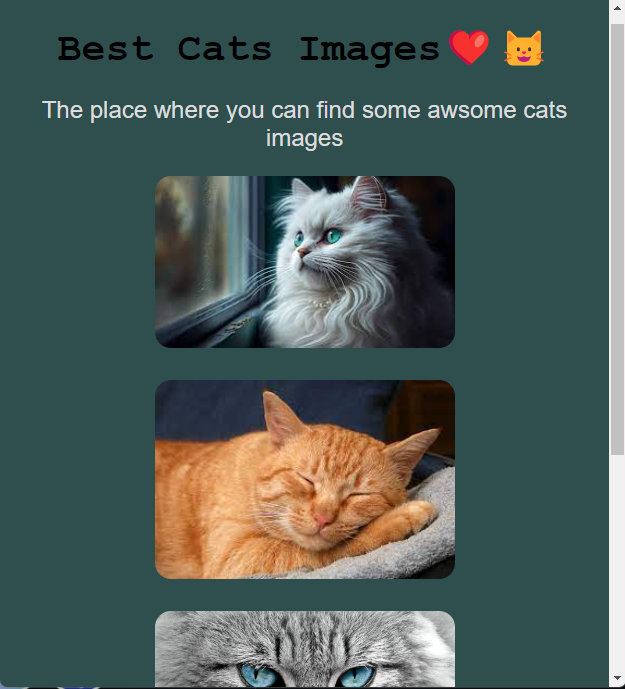
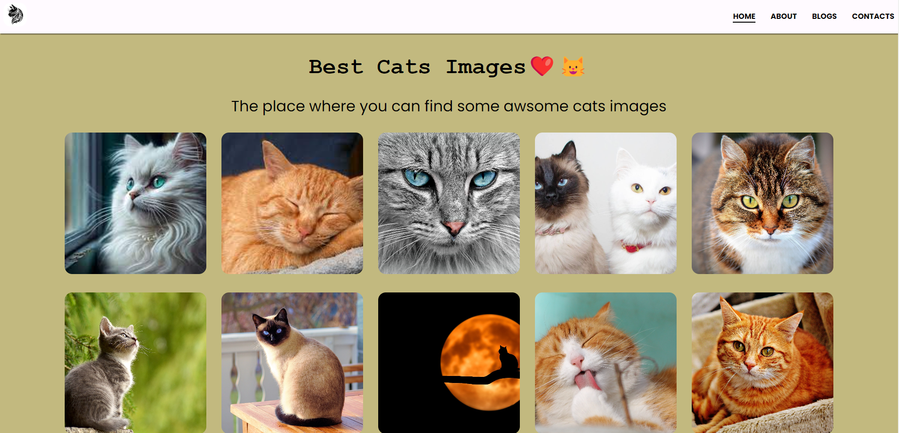
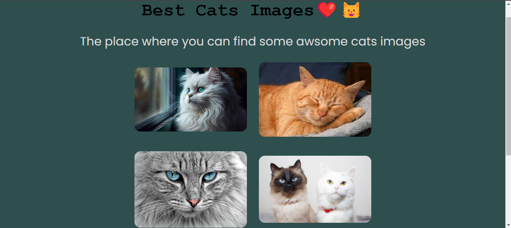
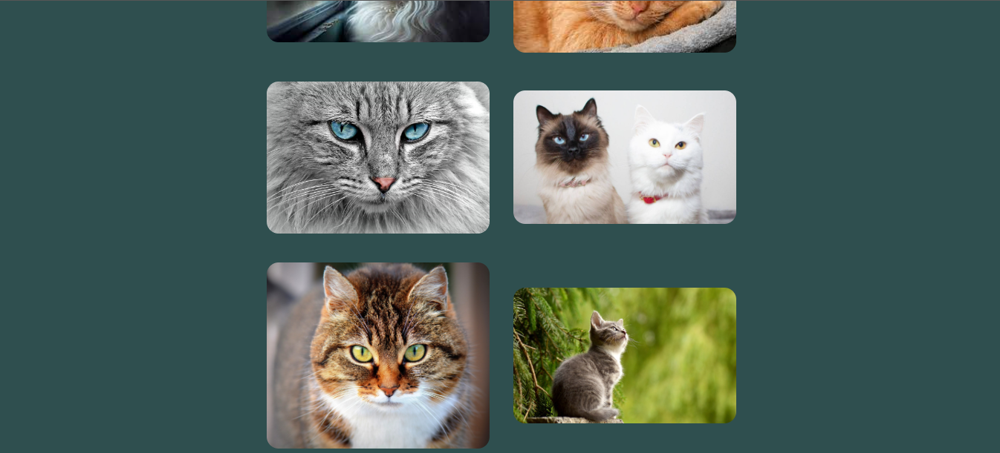
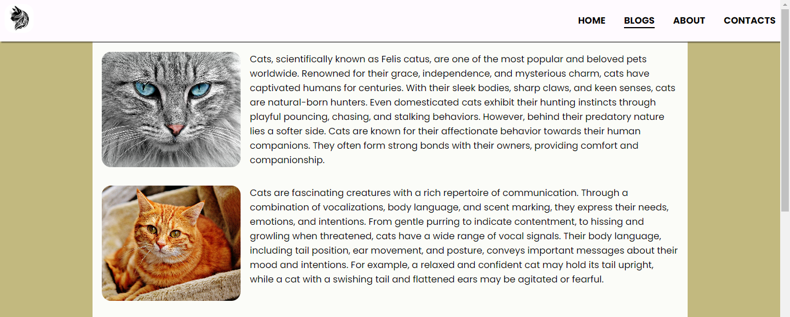
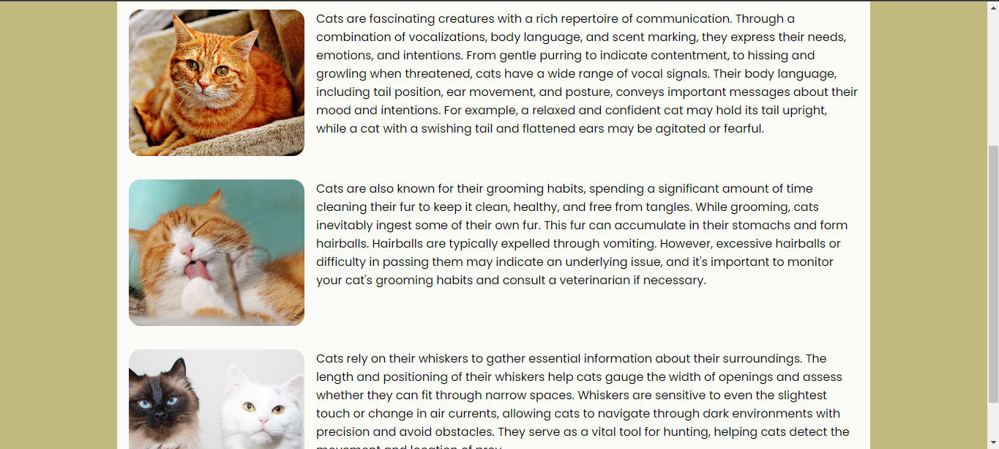
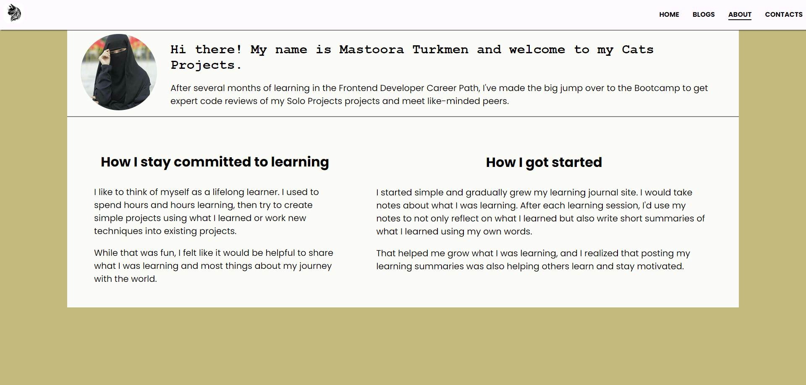
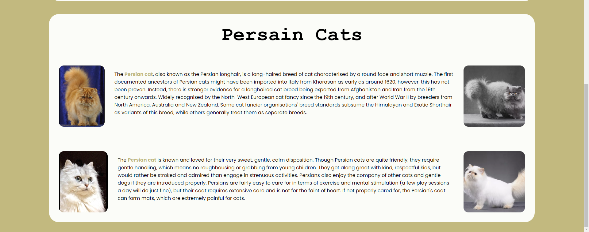

## First Day of Code

## Second Day of Code

1. Adding _a_ link to images
2. Adding other images to the site
3. Display **grid**
4. changing display _flex_ to display _grid_

## Third Day of Code

- Adding Navbar
- Adding _ul_ and _li_ to the nav
- Adding Link to the **Home**, **About**, **Blogs**, and **Contact**.
- Adding _Cat Logo_ on Site
- Changing the _background color_ and adding **Box Shadow** on navbar
- Adding more cat images
- Adding **hover**

## Fourth Day of Code

- Adding **Blogs** index

  - Working on Site Designing
  - Flex Box
  - Gap

- Adding Four Paragraphs About
  - _Cats_,
  - _Cats' Communication_
  - _Cats' Grooming_
  - _Cats' Whiskers_

## Fifth Day of Code

- Adding **About** Page Index
  - Adding about my learning progress
  - How I stay committed to learning
  - How I got started

## Sixth Day of Code

- Adding **Contacts** Page Index

  - Adding forms

    - Label
    - Input
    - textarea
    - Submit Button

  - Adding Logo to my site
  - Styling the form
    - flex box
    - padding
    - hover
    - focus
    - shadow

## Seventh Day of Code

- Adding Aritcle about _**Persain Cats**_
- some persain cats images
- links
-

